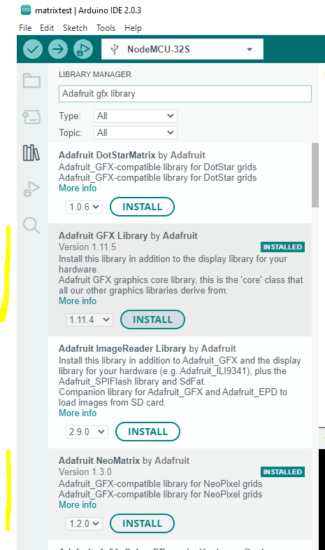

# Etape 3 : Et la lumière fut !
* Programmer une première fois notre Arduino
* Modifier le programme

## A : Configuration des bibliothèques de l'IDE Arduino
Si l'IDE Arduino a été bien installé, vous devriez pouvoir accéder à cette interface, puis installer les deux bibliothèques que nous allons utilisées.

Les bibliothèques sont des projets développés par des tiers sous forme de composants que nous allons pouvoir réutiliser comme des briques de Lego.

Pour cela, il faut se rendre dans le menu Tools > Managed Librairies:<br />


Puis installer les deux modules :<br />


En cliquant sur les boutons installation.


## B : Configuration de la carte électronique dans l'IDE Arduino
Avant de sélectionner la board, il est nécessaire d'ajouter le site vers lequel le logiciel pourrait récupérer les informations.
Il faut ouvrir les préférences :<br />

Puis ajouter cela:<br />
```
http://arduino.esp8266.com/stable/package_esp8266com_index.json,https://raw.githubusercontent.com/espressif/arduino-esp32/gh-pages/package_esp32_index.json
```

Il est possible avec l'IDE Arduino de programmer un grand nombre de carte électronique, il est donc nécessaire de pouvoir renseigner la notre. Pour cela nous devons installer le *package* adapté.<br />


Il faut sélectionner le Board Manager (icône sur le côté), puis rechercher ESP8266, puis installler

## C : Télécharger le code puis l'ouvrir dans l'IDE Arduino
* Télécharger les sources du programme sur votre ordinateur :<br />


* Décompresser l'archive dans un dossier
* Depuis l'IDE Arduino, ouvrir le dossier (File > Open) puis sélectionner shinealight.ino

Vous devriez arriver ici :<br />


* Selectionner la carte et le port


* Brancher le port USB
* Rechercher NodeMCU-32S et le port USB

* Appuyer sur **upload**

* A l'apparition de **Connection....**, presser le bouton **100** sur la carte à droite du port USB

* L'IDE doit vous afficher ce résultat à la fin


Et vous devriez pouvoir profiter d'un petit pixel rouge qui se balade sur l'afficheur LED. Félications !

## D : Changement de couleur
Dernière étape : il faut maintenant que vous trouviez un moyen pour changer la couleur de rouge en vert. Un indice
```C
  matrix.drawPixel(column,line++,matrix.Color(255, 0, 0));
```